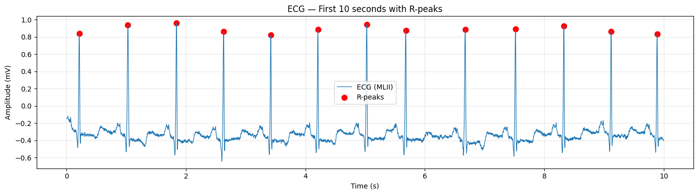
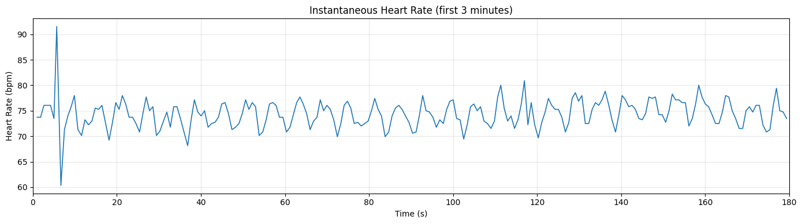

# physionet-ecg-detector
# ECG R-peak Detection and Instantaneous Heart Rate Estimation

**Author:** Alexandra Anita Flores
**Dataset:** MIT-BIH Arrhythmia Database, Record 100, MLII channel
**Source:** https://physionet.org/content/mitdb/1.0.0/

---

## Project Description

This project implements a rule-based signal processing algorithm to detect R-peaks from ECG signals and compute instantaneous heart rate, following the PhysioNet Technical Exercise guidelines.

---

## Approach

1. Bandpass filtering (5–15 Hz) to remove noise and baseline drift
2. Derivative, squaring, and moving window integration to enhance QRS complexes
3. Peak detection using `scipy.signal.find_peaks` with amplitude threshold and minimum distance constraint
4. Peak refinement by searching local maxima in ±20 ms window on raw ECG signal
5. Heart rate computed as HR = 60 / RR interval

---

## Assumptions

- Only MLII channel is used, as specified
- Sampling frequency taken from WFDB metadata (360 Hz)
- Fixed parameters: 5–15 Hz bandpass, 250 ms refractory period, ±20 ms refinement window
- **No reference annotations are used — detection is based solely on raw waveform data**

---

## Libraries

| Library | Purpose |
|---------|---------|
| wfdb | Load WFDB record from PhysioNet |
| numpy | Array operations |
| scipy | Butterworth filter, peak detection |
| matplotlib | Plots |

No ML frameworks or ECG-specific toolkits used.

---

## How to Run

### Google Colab (recommended)
1. Upload `detect_beats.ipynb` to Google Colab
2. Upload `100.hea` and `100.dat` to the Colab session (Files panel → Upload)
3. Runtime → Run all

### Local
```bash
pip install wfdb numpy scipy matplotlib
jupyter notebook detect_beats.ipynb
```

> Record 100 files must be downloaded manually from:
> https://physionet.org/content/mitdb/1.0.0/

---

## Output Results

**Total beats detected in full record: 2273**

### Plot 1 — First 10 seconds of MLII ECG with detected R-peaks


### Plot 2 — Instantaneous Heart Rate (first 3 minutes)


---

## Summary Statistics

| Metric | Value |
|--------|-------|
| Total beats detected | **2273** |
| Record duration | 30.1 min |
| First RR interval | 0.814 sec |
| First HR value | 73.7 bpm |
| Mean HR | 75.8 bpm |
| HR range | 52.0 – 116.8 bpm |
